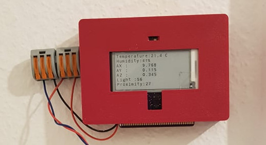
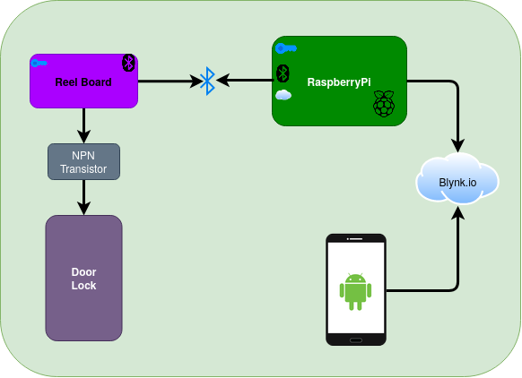
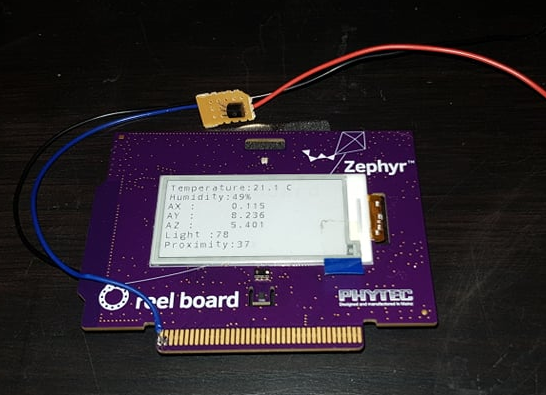
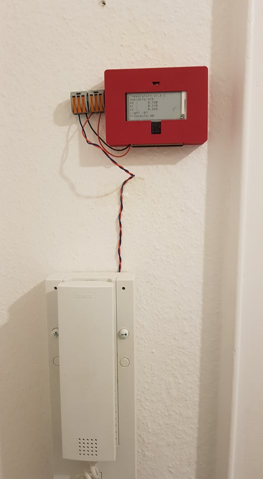

<!--- # apartment_door_ble
Contact less control of apartment door using the Bluetooth Low Energy
-->
# Making your apartment lock smart with Bluetooth Low Energy(BLE)
> During the times of Covid-19, its time to make a contact-less door opener

<table>
  <tr>
    <td>
      
    </td>
  </tr>
</table>

## Background
During the corona crises, I decided to open the apartment door using my smart phone. I have documented in here, [Github](https://github.com/aqeelarshad19/apartment_door_connected). It consisted of an esp8266 connected via Wifi to be connected to a cloud platform and a relay to drive the button. 
The problem with Wifi and electromechanical relays is that they are not power efficient.

## Idea
The Bluetooth Low Energy(BLE) and transistors are comparatively energy efficient. So, I decided to upgrade the door lock opener with BLE. 

<table>
  <tr>
    <td>
      
    </td>
  </tr>
</table>
The idea is to use a BLE based board to be able to still control it over the Internet/cloud. The smart phone sends a request via [cloud](blynk.io), the raspberry-pi acts as a gateway between cloud and the BLE device. 

## Reel Board
The reel board made by [PHYTEC](https://www.phytec.de/produkt/internet-of-things/reelboard/) is equipped with an Epaper Display, environmental sensors, and Blue-tooth connectivity. 
<table>
  <tr>
    <td>
      
    </td>
  </tr>
</table>

## Security 
To keep anyone from hacking away the BLE lock. The opening of the lock involved a challenge response. As soon as the central device connects to the peripheral, it can read the plain-text to which it must provide response after solving it. 

## Connected to the lock 
<table>
  <tr>
    <td>
      
    </td>
  </tr>
</table>

### Circuit Diagram with the Transistor
<table>
  <tr>
    <td>
      
    </td>
  </tr>
  <tr>
    <td>
        The circuit diagram can be found here [forum.iobroker.net](https://forum.iobroker.net/topic/7660/siedle-klingel-türöffner-mit-esp8266-und-mqtt/12) or [Here](https://forum.iobroker.net/assets/uploads/files/8530_schaltungt_.png)
    </td>
  </tr>
</table>

### Intercom wiring diagram
After looking at the multiple Internet forums to look for the wiring diagram for my intercom. I could only find a few links in German language. It pin-outs for the HTS-711 01.

<table>
  <tr>
    <th>
      Pin Name
    </th>
    <th>
      Function
    </th>
  </tr>
  <tr>
    <td>
      ERT
    </td>
    <td>
      Signal to indicate a ring bell
    </td>
  </tr>
  <tr>
    <td>
      7 
    </td>
    <td>
      Positive volts (12-24 VDC)
    </td>
  </tr>
    <tr>
    <td>
      1
    </td>
    <td>
      Negative or Ground
    </td>
  </tr>
  <tr>
    <td>
      15
    </td>
    <td>
      Monitor signal
    </td>
  </tr>
  <tr>
    <td>
      16
    </td>
    <td>
      Monitor signal
    </td>
  </tr>
</table>

The voltage between the Pin-1 and Pin-7 range from 12-24 Volts DC but they have very limited current available ~ 15mA.

### Blynk.io IoT Cloud
One need to install the andriod app from [blynk.io](https://blynk.io/en/getting-started). Inside the app, it provides some free credits to add different features inside the app. I added a button and a virtual blinking led. After creating the app, it sends the Auth-token needed inside the firmware. The firmware/sketch can be generated from the link below: 
- [Example code generator](https://examples.blynk.cc/) 

<table>
  <tr>
    <td>
      
    </td>
  </tr>
</table>

## TODO
- Update the source code from raspi and zypher 

## Weather info 
The next step is to add weather support to be displayed over the e-ink display. To save the power the display only gets updated when someone is in-front of the reel board. The IR distance sensor on-board provides distance values. 

## Links and References and Acknowledgments
- Ejaad-Nama, a is newsletter. which cover different technology news. Please, subscribe [here](https://ejaadnama.substack.com/)
- [German Thread about the siedle intercom lock system](https://forum.iobroker.net/topic/7660/siedle-klingel-türöffner-mit-esp8266-und-mqtt/39) [1]
- https://forum.iobroker.net/assets/uploads/files/1574673353705-siedle-spannungen-anmerkung-2019-11-18-100717.png 
- [On-line photo editor](https://pixlr.com/)
- [Draw.io](https://app.diagrams.net/) 
- https://pixabay.com/vectors/building-tall-housing-houses-48626/
- https://github.com/audef1/magicdooropener 
- http://androidcontrol.blogspot.com/2015/05/arduino-wifi-control-with-esp8266-module.html
- https://forum.fritzing.org/t/lm2596-step-down-module/6380 
- https://arduinomodules.info/ky-019-5v-relay-module/
- https://images-na.ssl-images-amazon.com/images/I/61kBdGlWCzL._SX679_.jpg 
- This `README` [template](https://github.com/KrauseFx/markdown-to-html-github-style) helped me alot to quickly write this document
## The Next Step
### Put the weather info over it
<!---
## Patreon 
-->

##### Buy me a toilet roll/hand sanitizers or a Mask. Else a coffee, if we are out of corona times ;) 

<!---
<h3 style="text-align: center; font-size: 35px; border: none">
  <a href="https://github.com/KrauseFx/markdown-to-html-github-style" target="_blank" style="text-decoration: none;">
    🔰 Open GitHub page 🔰
  </a>
</h3>
-->
